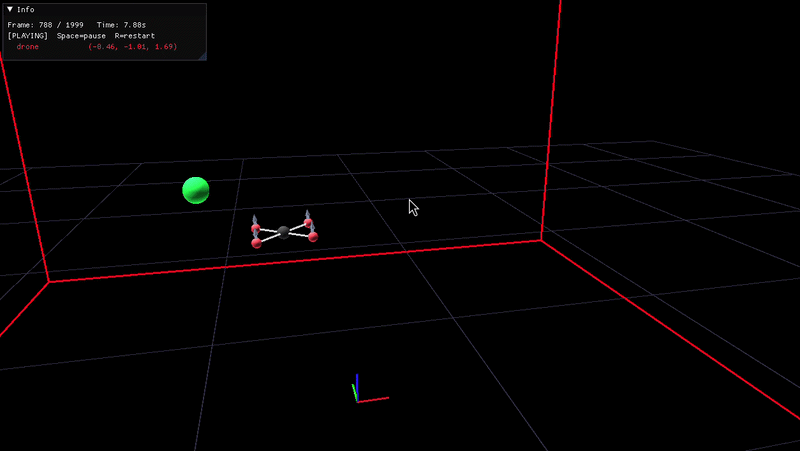
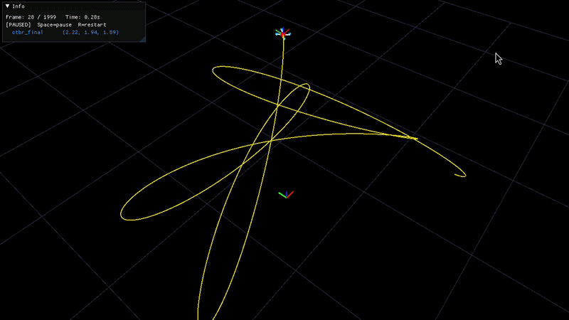
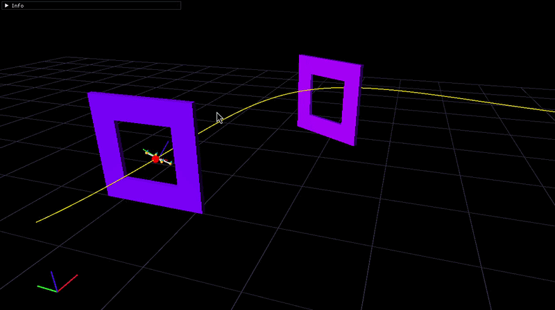
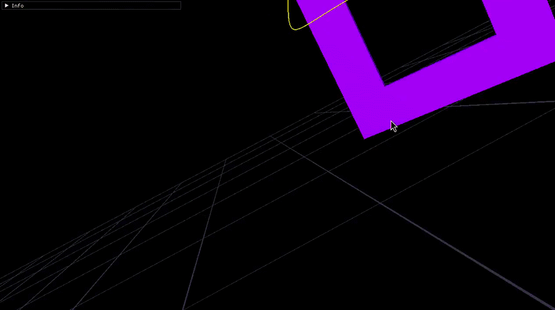
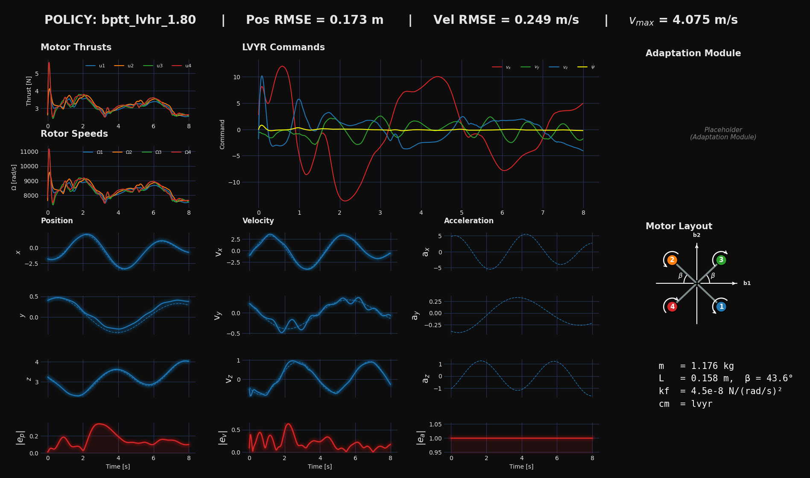

# 🍃 AirBender - Master Thesis Project  🍃

## A differentiable quadrotor simulator build in PyTorch - (⚠️Ongoing Work⚠️)

AirBender is PyTorch-based simulator for training neural network policies to control quadrotors. The project supports several control abstractions, training tasks, includes domain randomization and a visualization enginge built in Taichi Lang. Training can be executed in parallel environments at the GPU for efficient data collection.


<!-- <div align="center">


</div> -->

<div align="center">
  
  
  <br>
  
  
</div>


<!-- ## Overview -->
## 📉Loss 

### Trajectory Tracking Task [env=tt]
For the trajectory tracking task, the stage loss at each timestep $k$, denoted as $\mathcal{L}(\mathbf{x}_k^\text{ref}, \mathbf{x}_k)$, is formulated as a weighted sum of position, velocity, and attitude alignment errors, together with a penalization to the body rates to improve stability during early training.

$$\mathcal{L}(\mathbf{x}_k^\text{ref}, \mathbf{x}_k) =
\lambda_p \|\mathbf{p}_k^\text{ref} - \mathbf{p}_k\|_2 +
\lambda_v \|\mathbf{v}_k^\text{ref} - \mathbf{v}_k\|_2 +
\lambda_a \left(1 - \mathbf{\hat{b}}_{3,k} \cdot \mathbf{z}_k \right) +
\lambda_\omega \|\boldsymbol{\omega}_k\|_2^2
$$

### Path Progress Task
⚠️ TODO
<!-- ### Racing Task
⚠️ TODO -->

## 🧠Neural Network 
The neural network is constructed in [`utils/nn.py`](utils/nn.py) as a simple feedforward multi-layer perceptron (MLP). The policy takes 16 observational inputs including the quadrotor's state and reference trajectory.

$$\mathbf{o}_k =
\begin{bmatrix}
\mathbf{p}_k^\text{ref} - \mathbf{p}_k \\  
\mathbf{v}_k^\text{ref} - \mathbf{v}_k \\
\mathbf{a}_k^\text{ref} \\
\mathbf{q}_k \\
\boldsymbol{\omega}_k
\end{bmatrix}
\in \mathbb{R}^{16}$$

Four different control abstractions are implemented; cm=[srt,ctbr,lvhr,lvhr+g].


 **Single Rotor Thust (SRT)**: 

The neural network outputs direct motor commands. 

$$\boldsymbol{T}_{\text{cmd}} = \boldsymbol{u} \left( T_{\text{max}}- T_{\text{min}} \right) + T_{\text{min}},\quad \boldsymbol{u} \in [0, 1]\in \mathbb{R}^4\ $$

 **Collective Thrust and Body Rates (CTBR)**: 

The neural network outputs the total desired thrust $T_c$ and angular rates $\boldsymbol{\omega}^{\mathcal{B}}$. 

$$T_{c, \text{cmd}} = u_1  (T_{\text{max}} - T_{\text{min}}) + T_{\text{min}} ,\quad \omega_{i, \text{cmd}} = (2u_{i+1} - 1)  \omega_{i, \text{max}}, \ i \in \{1, 2, 3\} $$

**Linear Velocities and Heading Rate (LVHR)**: 

The policy ouputs body velocities $\mathbf{v}^{\mathcal{B}}$ and heading rate $\dot{\eta}$. Then, these are mapped in a similar fashion as in [[Lee et al.](https://ieeexplore.ieee.org/document/5717652)] to obtain CTBR.

$$v_{i, \text{cmd}} = (2u_{i} - 1)  v_{i, \text{max}}, \ i \in \{1, 2, 3\}, \quad \dot{\eta}_{\text{cmd}} = (2u_{4} - 1)  \dot{\eta}_{ \text{max}}$$

**Linear Velocities and Heading Rate plus Geometric Gains (LVHR+g)**: 

Same as LVHR, but the policy is augmented to output the geometric gains $kv$, $kR$ and $k\omega$.

<!-- ### 🚁Quadrotor Dynamics 
⚠️ TODO -->

<!-- ### 🏋️Training

The training logic is implemented in [`train.py`](train.py). The framework supports training on both CPU and GPU with parallel environments for efficient data collection. Training runs for a configurable number of episodes, each containing a specified number of steps. The optimization horizon $T$ is user-configurable and determines when the acumulated loss $\mathcal{L}$ is backpropageted through time.  -->


## 🔹Usage

### Training
```bash
python train.py env=[pc,tt,racing] cm=[srt,ctbr,lvhr,lvhr+g]
```
<!-- Trains a policy for the control mode specified by the parameter [`cm`](https://github.com/aadamgb/diff-RL/blob/2d501c9cc4309554f6ee41fb654d6027d55d48af/train.py#L26). The policy will be saved in `outputs/{cm}.pt`. -->

### Evaluation & Visualization
<!-- To evaluate the policy, add it to this [dict](https://github.com/aadamgb/diff-RL/blob/2d501c9cc4309554f6ee41fb654d6027d55d48af/test_model.py#L87) then run: -->

```bash
python test.py env=[pc,tt,racing]
```
Multiple policies can be loaded simultaneously. 

## 📓 Requirements

- PyTorch
- Taichi Lang
- NumPy
- Matplotlib


## 🌳 Project Structure

```
├── cfg/
│   ├── config.yaml                   # Root Hydra config
│   ├── dynamics/
│   │   └── a300.yaml                 # Quadrotor physics params
│   ├── env/                          # Per-environment configs (tt, pc, racing)
├── dynamics/
│   ├── quadrotor_dynamics.py         # 3D quadrotor physics model
│   └── surrogate_gradient.py         # Surrogate gradient for non-differentiable ops
├── controller/
│   └── controllers.py                # Control abstractions (SRT, CTBR, LVHR, LVHR+g)
├── env/
│   ├── position_control.py           # Position control environment
│   ├── trajectory_tracking.py        # Trajectory tracking environment
│   ├── racing.py                     # Racing environment
│   └── hover.py                      # Hover environment
├── utils/
│   ├── nn.py                         # Neural network policy (MLP)
│   ├── trajectory.py                 # Trajectory generation
│   ├── math.py                       # Math utilities
│   ├── plotter.py                    # Training plots
│   ├── randomize.py                  # Domain randomization
│   └── replay_multi.py               # Policy replay & visualization
├── miscellaneous/
│   ├── race_tracks/                  # Race track YAML definitions
│   └── trajectories/                 # Pre-generated reference trajectories
├── train.py                          # Training script
├── test.py                           # Policy evaluation & visualization
└── outputs/                          # Saved policies and other data
```


## 🍭 Dashboard
<div align="center">
  
</div>

## 🚧 TODO List 
- [ ] Polish the code: Remove unused testing and validation scripts, clean up commented lines.... make it more readable.
- [ ] Add path prgoress environment.
- [ ] Include the quadratic aerodynamic model to the quadrotor dynamics.
- [ ] Add the rest of the params to the randomization engine.
- [ ] Augment the loss function for the TT task to consider the full quadrotor state (q, a, u, jerk, snap...).  
- [ ] Merge PPO branch  to main.


---

**P.S.: This project is a work in progress and is not finished yet, will be by mid-August.** Further implementation details can be found in [thesis_report.pdf](https://github.com/aadamgb/master_thesis/blob/main/main.pdf).